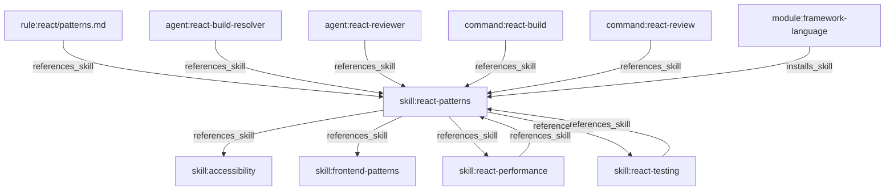
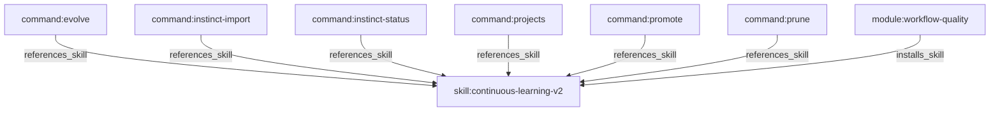
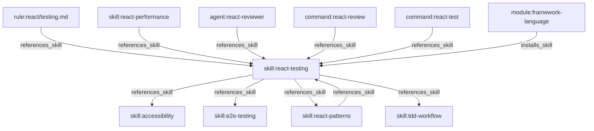
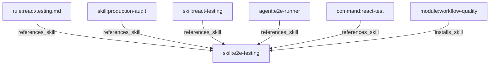
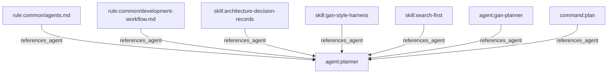
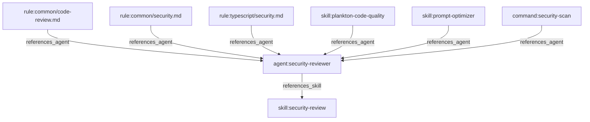
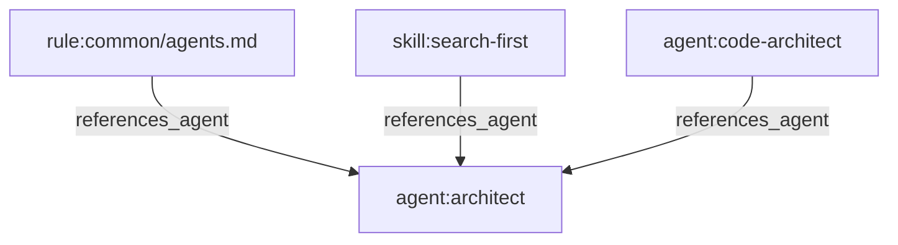
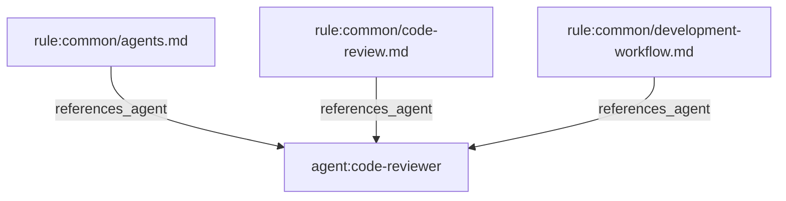
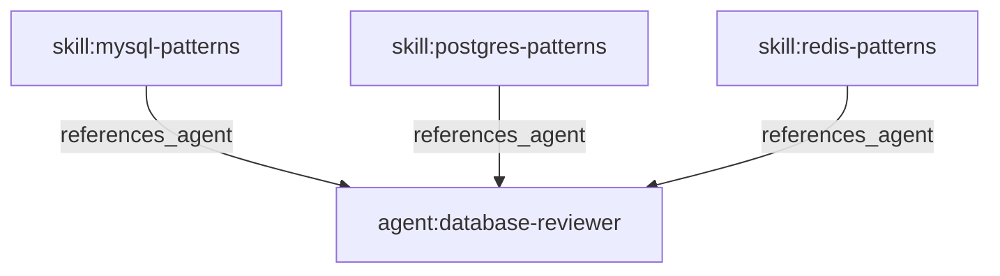

# ECC 依赖关系图(自动生成,请勿手改)

> 本文档由 `node .claude/skills/dependency-graph/scripts/relationship-render.js --write`(或 `npm run render`)自动生成。
> 数据来源:本 skill 目录下的 4 个 generator(rule/skill/agent/hook registry)
> + 只读复用 `scripts/ci/generate-command-registry.js` 已导出的 `extractReferences`/`extractDescription`/`generateRegistry`(该文件本身未被修改)
> + 只读复用 `manifests/install-modules.json`(给其他 harness 用的选择性安装清单,用来给 skill 打分类标签)。
> 删除/清理任何组件前,先用下面的反向查询确认没人依赖它:
> `node .claude/skills/dependency-graph/scripts/relationship-query.js dependents <id>`

## 节点统计

| 类型 | 数量 | 说明 |
|---|---|---|
| rule | 44 | rules/**/*.md |
| skill | 167 | skills/*/SKILL.md |
| agent | 43 | agents/*.md |
| command | 77 | commands/*.md |
| hook | 30 | hooks/hooks.json + hooks/*/hooks.json |
| script | 28 | 被某个 hook 引用、且文件确实存在的脚本 |
| module | 26 | manifests/install-modules.json 里的安装模块 |
| **边总数** | **440** | 上述节点之间的全部引用关系 |

## 按类别浏览

### skill

数据来源:`manifests/install-modules.json`。这是给其他 harness(cursor/codebuddy/qwen 等)用的选择性安装清单,不是专门维护的分类表,所以覆盖率不是 100%——"未归类"那一行不是漏统计,是这份清单本身没提到那些 skill。

| module | 技能数 | 说明 |
|---|---|---|
| `module:workflow-quality` | 43 | Evaluation, TDD, verification, compaction, and learning skills, including the legacy continuous-learning v1 path. |
| `module:framework-language` | 40 | Core framework, language, and application-engineering skills. |
| `module:agentic-patterns` | 33 | Agentic engineering, autonomous loops, agent harness construction, and LLM pipeline optimization skills. |
| `module:operator-workflows` | 12 | Connected-app operator workflows for setup audits, billing operations, program tracking, Google Workspace, and network optimization. |
| `module:security` | 8 | Security review and security-focused framework guidance. |
| `module:database` | 7 | Database and persistence-focused skills. |
| `module:optimization-workflows` | 7 | Parallel execution, benchmarking, data-throughput, latency, and recursive decision-ledger skills for faster evidence-backed work. |
| `module:devops-infra` | 6 | Deployment workflows, Docker patterns, and infrastructure skills. |
| `module:machine-learning` | 4 | Production machine-learning engineering workflows for data contracts, reproducible training, evaluation, deployment, monitoring, and rollback. |
| `module:research-apis` | 4 | Research and API integration skills for deep investigations and model integrations. |
| `module:business-content` | 1 | Business, writing, market, and investor communication skills. |
| `module:orchestration` | 1 | Worktree/tmux orchestration runtime and workflow docs. |
| _(未归类)_ | 1 | 存在于 `skills/`,但没被任何 install module 收录 |

想看某个 module 具体装了哪些 skill:`node .claude/skills/dependency-graph/scripts/relationship-query.js uses module:<id>`。

### command

按 `generate-command-registry.js` 推断的类型分组:

- **build**(1 个):`command:setup-pm`
- **general**(10 个):`command:epic-publish`、`command:epic-sync`、`command:epic-unblock`、`command:hookify`、`command:hookify-configure`、`command:hookify-list`、`command:loop-status`、`command:pm2`、`command:projects`、`command:sessions`
- **orchestration**(11 个):`command:gan-build`、`command:multi-backend`、`command:multi-execute`、`command:multi-frontend`、`command:multi-plan`、`command:multi-workflow`、`command:orch-add-feature`、`command:orch-build-mvp`、`command:orch-change-feature`、`command:orch-fix-defect`、`command:orch-refine-code`
- **planning**(2 个):`command:gan-design`、`command:update-codemaps`
- **refactoring**(1 个):`command:build-fix`
- **review**(15 个):`command:ecc-guide`、`command:epic-claim`、`command:epic-decompose`、`command:epic-review`、`command:epic-validate`、`command:instinct-status`、`command:learn`、`command:model-route`、`command:orch-review`、`command:plan-canvas`、`command:promote`、`command:prune`、`command:santa-loop`、`command:security-scan`、`command:skill-health`
- **testing**(37 个):`command:aside`、`command:auto-update`、`command:checkpoint`、`command:code-review`、`command:cost-report`、`command:evolve`、`command:fastapi-review`、`command:feature-dev`、`command:harness-audit`、`command:hookify-help`、`command:instinct-export`、`command:instinct-import`、`command:jira`、`command:learn-eval`、`command:loop-start`、`command:plan`、`command:plan-prd`、`command:pr`、`command:project-init`、`command:prp-commit`、`command:prp-implement`、`command:prp-plan`、`command:prp-pr`、`command:prp-prd`、`command:python-review`、`command:quality-gate`、`command:react-build`、`command:react-review`、`command:react-test`、`command:refactor-clean`、`command:resume-session`、`command:review-pr`、`command:save-session`、`command:skill-create`、`command:test-coverage`、`command:update-docs`、`command:vue-review`

### hook

按触发事件(event)分组:

- **PostToolUse**(10 个):`hook:post:bash:dispatcher`、`hook:post:ecc-context-monitor`、`hook:post:ecc-metrics-bridge`、`hook:post:edit:accumulator`、`hook:post:edit:console-warn`、`hook:post:edit:design-quality-check`、`hook:post:governance-capture`、`hook:post:observe:continuous-learning`、`hook:post:quality-gate`、`hook:post:session-activity-tracker`
- **PostToolUseFailure**(1 个):`hook:post:mcp-health-check`
- **PreCompact**(1 个):`hook:pre:compact`
- **PreToolUse**(8 个):`hook:pre:bash:dispatcher`、`hook:pre:config-protection`、`hook:pre:edit-write:gateguard-fact-force`、`hook:pre:edit-write:suggest-compact`、`hook:pre:governance-capture`、`hook:pre:mcp-health-check`、`hook:pre:observe:continuous-learning`、`hook:pre:write:doc-file-warning`
- **SessionEnd**(2 个):`hook:session:end`、`hook:session:end:marker`
- **SessionStart**(2 个):`hook:session-start:plan-canvas-sessions`、`hook:session:start`
- **Stop**(6 个):`hook:stop:check-console-log`、`hook:stop:cost-tracker`、`hook:stop:desktop-notify`、`hook:stop:evaluate-session`、`hook:stop:format-typecheck`、`hook:stop:session-end`

### rule

按 `rules/` 下的一级目录(即语言/主题)分组,只给数量——具体文件已经在下面"extends 继承关系"里能看到:

| 目录(语言/主题) | rule 文件数 |
|---|---|
| `common` | 10 |
| `web` | 7 |
| `python` | 6 |
| `java` | 5 |
| `react` | 5 |
| `typescript` | 5 |
| `vue` | 5 |
| `(根目录)` | 1 |

### agent

暂无分类数据源——仓库里没有任何地方给这 43 个 agent 做过主题分组。想了解某个 agent 的关系,直接查它的依赖:`node .claude/skills/dependency-graph/scripts/relationship-query.js dependents/uses <id>`。

## rules/ 的 extends 继承关系

按继承目标(即被继承的 common/*.md,或 rules/common/development-workflow.md 这种横向继承)分组,
括号内是被继承的次数,子项是继承它的文件:

- `rule:common/patterns.md`(被 6 个文件继承)
  - `rule:java/patterns.md`
  - `rule:python/patterns.md`
  - `rule:typescript/patterns.md`
  - `rule:vue/patterns.md`
  - `rule:web/design-quality.md`
  - `rule:web/patterns.md`
- `rule:common/coding-style.md`(被 5 个文件继承)
  - `rule:java/coding-style.md`
  - `rule:python/coding-style.md`
  - `rule:typescript/coding-style.md`
  - `rule:vue/coding-style.md`
  - `rule:web/coding-style.md`
- `rule:common/hooks.md`(被 5 个文件继承)
  - `rule:java/hooks.md`
  - `rule:python/hooks.md`
  - `rule:typescript/hooks.md`
  - `rule:vue/hooks.md`
  - `rule:web/hooks.md`
- `rule:common/security.md`(被 5 个文件继承)
  - `rule:java/security.md`
  - `rule:python/security.md`
  - `rule:typescript/security.md`
  - `rule:vue/security.md`
  - `rule:web/security.md`
- `rule:common/testing.md`(被 5 个文件继承)
  - `rule:java/testing.md`
  - `rule:python/testing.md`
  - `rule:typescript/testing.md`
  - `rule:vue/testing.md`
  - `rule:web/testing.md`
- `rule:common/git-workflow.md`(被 1 个文件继承)
  - `rule:common/development-workflow.md`
- `rule:common/performance.md`(被 1 个文件继承)
  - `rule:web/performance.md`
- `rule:typescript/coding-style.md`(被 1 个文件继承)
  - `rule:react/coding-style.md`
- `rule:typescript/patterns.md`(被 1 个文件继承)
  - `rule:react/patterns.md`
- `rule:typescript/security.md`(被 1 个文件继承)
  - `rule:react/security.md`
- `rule:typescript/testing.md`(被 1 个文件继承)
  - `rule:react/testing.md`

## 被引用最多的 skill

被依赖次数最高的 5 个 skill,各自的局部关系图(depth 1,能看出具体是谁在依赖它):

**`skill:accessibility`**(被依赖 11 次)

```mermaid
graph TD
  rule_react_patterns_md["rule:react/patterns.md"] -->|references_skill| skill_accessibility["skill:accessibility"]
  skill_intent_driven_development["skill:intent-driven-development"] -->|references_skill| skill_accessibility["skill:accessibility"]
  skill_motion_ui["skill:motion-ui"] -->|references_skill| skill_accessibility["skill:accessibility"]
  skill_react_patterns["skill:react-patterns"] -->|references_skill| skill_accessibility["skill:accessibility"]
  skill_react_performance["skill:react-performance"] -->|references_skill| skill_accessibility["skill:accessibility"]
  skill_react_testing["skill:react-testing"] -->|references_skill| skill_accessibility["skill:accessibility"]
  agent_react_reviewer["agent:react-reviewer"] -->|references_skill| skill_accessibility["skill:accessibility"]
  command_multi_plan["command:multi-plan"] -->|references_skill| skill_accessibility["skill:accessibility"]
  command_react_review["command:react-review"] -->|references_skill| skill_accessibility["skill:accessibility"]
  command_react_test["command:react-test"] -->|references_skill| skill_accessibility["skill:accessibility"]
  module_framework_language["module:framework-language"] -->|installs_skill| skill_accessibility["skill:accessibility"]
```

**`skill:react-patterns`**(被依赖 8 次)

**`skill:continuous-learning-v2`**(被依赖 7 次)

**`skill:react-testing`**(被依赖 7 次)

**`skill:e2e-testing`**(被依赖 6 次)

第 6~15 名:

| skill | 被依赖次数 |
|---|---|
| `skill:frontend-patterns` | 6 |
| `skill:orch-pipeline` | 6 |
| `skill:python-patterns` | 6 |
| `skill:orch-add-feature` | 5 |
| `skill:orch-change-feature` | 5 |
| `skill:security-review` | 5 |
| `skill:tdd-workflow` | 5 |
| `skill:backend-patterns` | 4 |
| `skill:browser-qa` | 4 |
| `skill:canary-watch` | 4 |

## 被引用最多的 agent

被依赖次数最高的 5 个 agent,各自的局部关系图(depth 1,能看出具体是谁在依赖它):

**`agent:planner`**(被依赖 7 次)

**`agent:security-reviewer`**(被依赖 6 次)

**`agent:architect`**(被依赖 3 次)

**`agent:code-reviewer`**(被依赖 3 次)

**`agent:database-reviewer`**(被依赖 3 次)

第 6~15 名:

| agent | 被依赖次数 |
|---|---|
| `agent:react-reviewer` | 3 |
| `agent:tdd-guide` | 3 |
| `agent:typescript-reviewer` | 3 |
| `agent:python-reviewer` | 2 |
| `agent:build-error-resolver` | 1 |
| `agent:e2e-runner` | 1 |
| `agent:mle-reviewer` | 1 |
| `agent:react-build-resolver` | 1 |
| `agent:vue-reviewer` | 1 |

## 孤儿引用(引用目标已不存在)

> 注意:并非每一条都是需要修的"死链接"。有些是引用了仓库外部的 skill(比如某个 OKX 官方 skill 包)
> 或用户个人 `.claude/skills/` 下的 skill,又或者是像"reviewer-class agent"这种描述性短语被误判成了具体引用。
> 确认是误报后,可以写进 `overrides.json` 的 `suppress` 列表让它以后不再出现。

| 引用来源(from) | 引用目标(to,已不存在) | 引用类型 |
|---|---|---|
| `skill:team-builder` | `agent:general-purpose` | references_agent |

## 如何使用

- 删除/清理某个组件前,先查它有谁依赖:
  `node .claude/skills/dependency-graph/scripts/relationship-query.js dependents <id>`
- 查某个组件自己引用/使用了什么:
  `node .claude/skills/dependency-graph/scripts/relationship-query.js uses <id>`
- 查某个节点周边的局部关系图(输出 mermaid,适合小范围查看,几十条边以内可读):
  `node .claude/skills/dependency-graph/scripts/relationship-query.js graph --from <id> --depth 2`
- 节点 id 格式:`rule:<rules/下的相对路径>`、`agent:<name>`、`skill:<name>`、`command:<name>`、`hook:<id>`。
- 也可以在 .claude/skills/dependency-graph/ 目录下用 `npm run <script>` 执行,见该目录下的 package.json。
