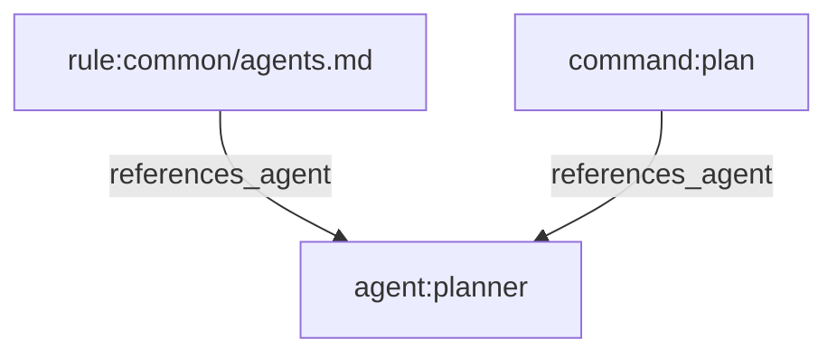

# 依赖关系图(dependency-graph)

追踪本仓库 `rules/`、`agents/`、`skills/`、`commands/`、`hooks/` 之间的交叉引用,删除或重命名组件前先确认没有遗留死引用;同时按 `manifests/install-modules.json` 的安装模块给 skill 打分类标签,支持"按类别浏览"。完全自包含在 `.claude/skills/dependency-graph/` 内(项目本地 skill,只在打开此仓库时加载),不修改仓库其他文件;只读引用两处外部数据:`scripts/ci/generate-command-registry.js` 已导出的函数,以及 `manifests/install-modules.json`(两者本身都未被修改)。完整设计说明见 [README.md](README.md)。

## 怎么用

所有命令都在仓库根目录下用纯 `node` 执行,不需要 npm(也可以进 `.claude/skills/dependency-graph/` 目录用 `npm run <script>`,见该目录下的 package.json):

1. **刷新数据**(rules/agents/skills/commands/hooks 有改动后都要重跑):

   ```bash
   node .claude/skills/dependency-graph/scripts/generate-rule-registry.js --write
   node .claude/skills/dependency-graph/scripts/generate-skill-registry.js --write
   node .claude/skills/dependency-graph/scripts/generate-agent-registry.js --write
   node .claude/skills/dependency-graph/scripts/generate-hook-registry.js --write
   node .claude/skills/dependency-graph/scripts/relationship-graph.js --write
   ```

   或者直接:`cd .claude/skills/dependency-graph && npm run refresh`(这会同时刷新数据和 `DEPENDENCY-GRAPH.md` 文档)。

2. **删除/重命名某个组件之前**,先查谁依赖它:

   ```bash
   node .claude/skills/dependency-graph/scripts/relationship-query.js dependents <id>
   ```

   如果查出来有依赖方,和用户一起确定处理方式:提醒一声、同步修改这些依赖方,或者确认影响可接受后仍然删除。

   **查出来是空的,也不代表 100% 没人依赖它。** 底层是启发式正则(见下面"已知局限"),裸的自然语言提及可能漏判——空结果只是把风险降低了,不是删除安全的证明。影响面大、拿不准的组件,删除前最好再手动搜一遍仓库全文确认。

3. **改动完成后**,重跑第 1 步,再重新生成可读文档:

   ```bash
   node .claude/skills/dependency-graph/scripts/relationship-render.js --write
   ```

4. 想确认工具本身是否正常工作,可以跑:

   ```bash
   node .claude/skills/dependency-graph/scripts/self-test.js
   ```

## 节点 id 格式

| 类型 | 格式 | 例子 |
|---|---|---|
| rule | `rule:<相对于 rules/ 的路径>` | `rule:java/coding-style.md` |
| agent | `agent:<名字>` | `agent:planner` |
| skill | `skill:<名字>` | `skill:jpa-patterns` |
| command | `command:<名字>` | `command:plan` |
| hook | `hook:<id>` | `hook:pre:bash:dispatcher` |
| module | `module:<manifests/install-modules.json 里的 module id>` | `module:framework-language` |
| script(仅当文件存在时才有这个节点) | `script:<路径>` | `script:scripts/hooks/pre-bash-dispatcher.js` |

## 按类别浏览

`DEPENDENCY-GRAPH.md` 里有一节"按类别浏览":skill 按 install module 分组(数据来源 `manifests/install-modules.json`,覆盖率约 198/278,不是权威分类)、command 按类型分组、hook 按触发事件分组、rule 按语言/主题目录分组。agent 目前没有分类数据源,只能靠 `dependents`/`uses` 查关系。想看某个 module 具体装了哪些 skill:

```bash
node .claude/skills/dependency-graph/scripts/relationship-query.js uses module:framework-language
```

## 示例

```bash
$ node .claude/skills/dependency-graph/scripts/relationship-query.js dependents skill:jpa-patterns
rule:java/coding-style.md  [references_skill]
rule:java/patterns.md  [references_skill]

$ node .claude/skills/dependency-graph/scripts/relationship-query.js orphans
(未发现孤儿引用)
```

`graph --from <id> --depth <n>` 会输出一段可以直接粘到 Markdown 里的 mermaid 代码块,比如 `graph --from agent:planner --depth 1`:



## 已知局限

- 引用识别是启发式正则,不是语法解析器:明确标记(`skill:`、`subagent_type:`、路径引用等)即使目标已删除也会记录,用于孤儿检测;含糊形式(裸加粗词等)只在匹配已知 skill/agent 名字时才计入,避免噪音。
- 引用了仓库外部的 skill/agent(比如内置的 `general-purpose`,或用户个人 `.claude/skills/`)会被标为孤儿,这是预期行为,不是死链接。
- 仍可能有误报(比如"a `<name>` agent"这种描述性短语)。确认误报后写进 `overrides.json` 的 `suppress`;扫不出来但确实存在的引用写进 `manual`。详见 [README.md 已知局限](README.md#已知局限)。

## overrides.json

```json
{
  "suppress": [{ "from": "skill:x", "to": "agent:reviewer-class", "type": "references_agent" }],
  "manual": [{ "from": "skill:x", "to": "skill:y", "type": "references_skill", "note": "为什么要加这条" }]
}
```

两个列表都是可选的,默认都是空数组。`relationship-graph.js` 在这个文件不存在时会直接跳过,不会报错。
